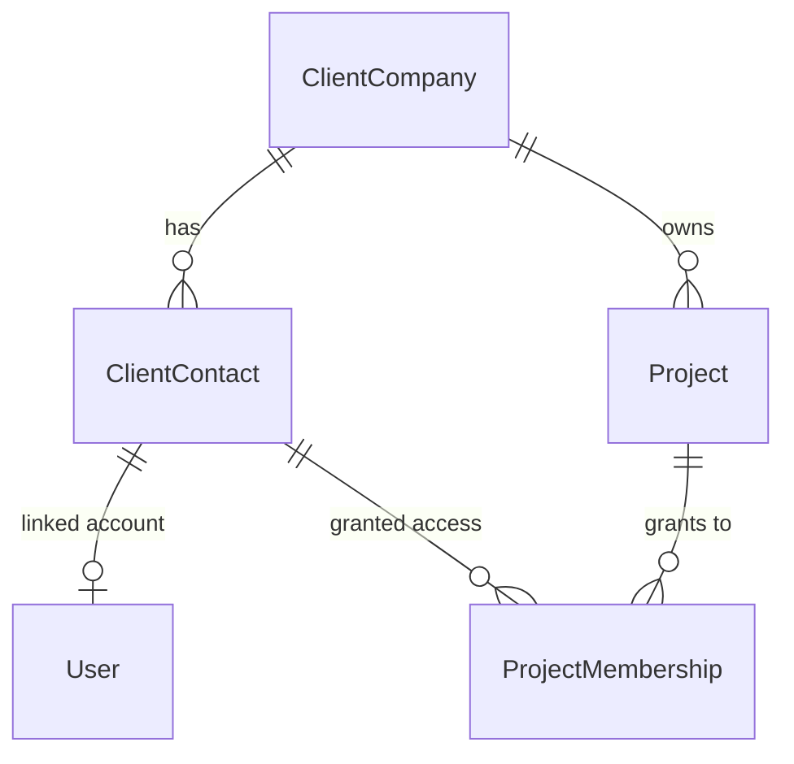
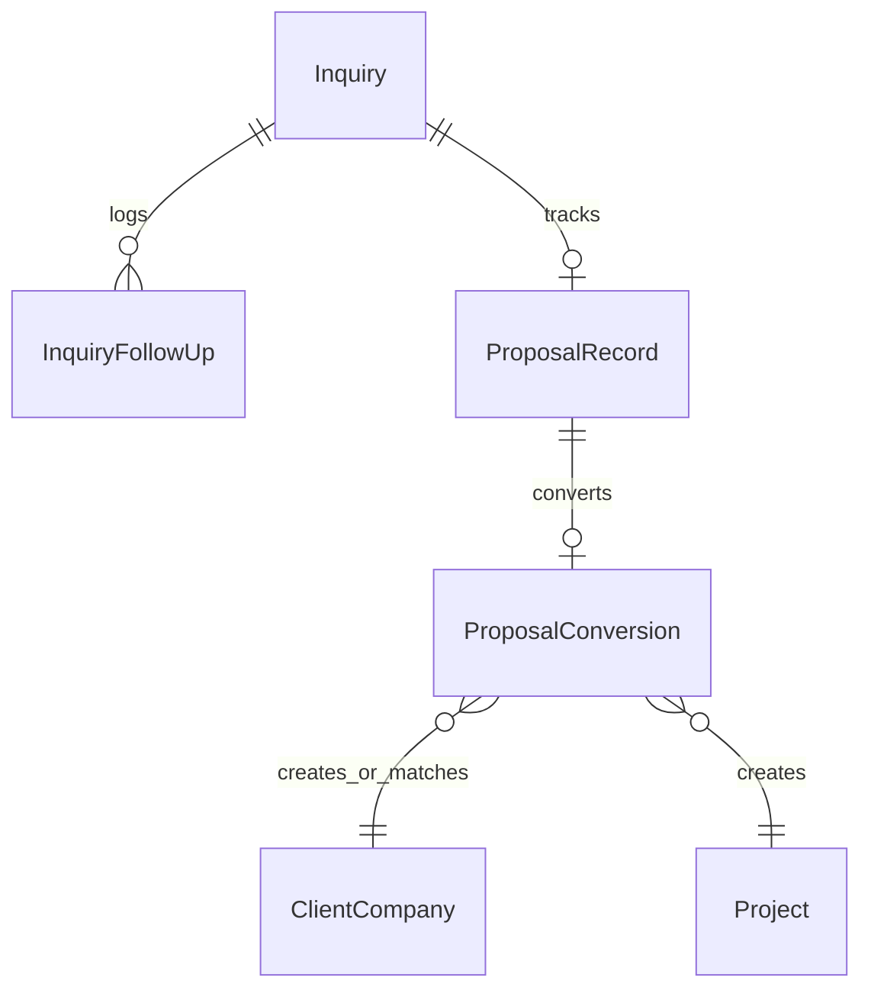
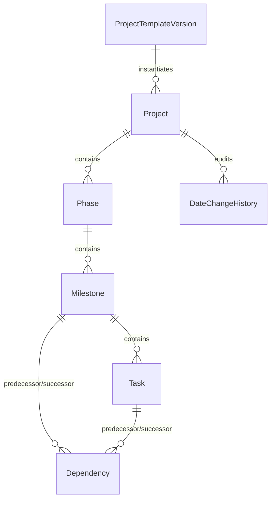
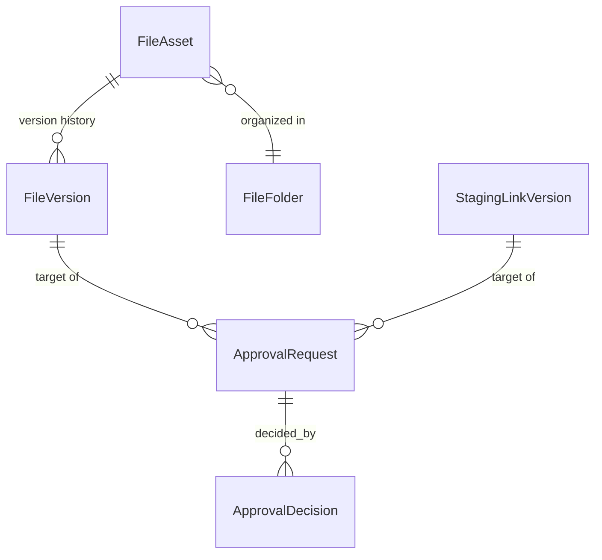

# YeffoHub — Domain Data Model (Phase 0)

Status: proposed logical model. The authoritative, buildable schema is
`prisma/schema.prisma`, introduced in Phase 1 and evolved per phase; this
document is the map that schema must implement, not a substitute for it.

Conventions used throughout (see ADR 0008 for rationale):
- Primary keys: UUID (v7 if the Postgres/Prisma versions in use support
  time-ordered generation cleanly; v4 otherwise — decided at Phase 1
  implementation, not a product-level concern).
- Every table: `createdAt`, `updatedAt`. Tables representing user-facing
  business records that the owner may need to recover add `deletedAt`
  (soft delete) instead of hard delete.
- Money/pricing fields are deliberately absent — YeffoHub does not do
  invoicing (§ scope boundaries).
- All foreign keys are enforced at the database level; cross-tenant
  relationships (client → project → company) are additionally checked in
  the service layer on every read/write (see `docs/permissions.md`).

## 1. Organizations, users, and access

- **User** — `id, email (unique), passwordHash, role (OWNER|CLIENT), name,
  timeZone, status (ACTIVE|DISABLED), createdAt, updatedAt, deletedAt`.
  One row per human who can sign in, owner or client contact alike.
- **ClientCompany** — `id, name, status (ACTIVE|ARCHIVED), createdAt,
  updatedAt, deletedAt`.
- **ClientContact** — `id, clientCompanyId → ClientCompany, userId →
  User (nullable until invitation accepted), name, email, phone, title,
  isPrimary, createdAt, updatedAt, deletedAt`. Exactly one non-deleted
  `isPrimary = true` contact per company, enforced by a partial unique
  index.
- **ProjectMembership** — `id, projectId → Project, clientContactId →
  ClientContact, grantedByUserId → User, grantedAt`. Explicit access grant
  for *additional* contacts; the primary contact's access to every project
  under their company is implicit (checked in the service layer against
  `ClientContact.isPrimary`, not materialized as membership rows, so it
  can never drift out of sync).

## 2. Sales workflow

- **Inquiry** — `id, clientCompanyId (nullable), contactName, contactEmail,
  contactPhone, source, status, notes, lastContactAt, nextFollowUpAt,
  createdAt, updatedAt`.
- **InquiryFollowUp** — `id, inquiryId → Inquiry, authorUserId → User,
  body, occurredAt, createdAt`. Append-only conversation/follow-up log.
- **ProposalRecord** — `id, inquiryId → Inquiry, title, status (owner-
  configurable list seeded with DRAFT/SENT/VIEWED/ACCEPTED/DECLINED/
  EXPIRED), sentAt, respondedAt, expiresAt, externalDocumentUrl,
  createdAt, updatedAt`.
- **ProposalConversion** — `id, proposalRecordId → ProposalRecord (unique),
  clientCompanyId → ClientCompany, primaryClientContactId → ClientContact,
  projectId → Project, convertedAt`. The unique constraint on
  `proposalRecordId` is what makes "mark accepted" idempotent: a repeated
  call finds the existing conversion and returns it instead of creating a
  second client/project (wrapped in one DB transaction — see ADR 0002).

## 3. Templates

- **ProjectTemplate** — `id, name, description, isDefault, createdAt,
  updatedAt, archivedAt`. The editable working copy the owner edits in the
  UI.
- **ProjectTemplatePhase / …Milestone / …Task** — working, orderable rows
  under a `ProjectTemplate`, each with `order`, `name`,
  `defaultOffsetDays` (relative scheduling), and (tasks only)
  `isClientVisible`, `isClientAssignable`.
- **ProjectTemplateVersion** — `id, projectTemplateId → ProjectTemplate,
  versionNumber, publishedAt, snapshotJson`. Publishing a template freezes
  its current phase/milestone/task structure into `snapshotJson`. A new
  `Project` always instantiates from a specific `ProjectTemplateVersion`,
  never from the live, editable `ProjectTemplate` rows — this is what
  guarantees "editing a template does not silently rewrite existing
  projects."

## 4. Project delivery hierarchy

- **Project** — `id, clientCompanyId → ClientCompany, primaryContactId →
  ClientContact, projectNumber (unique, e.g. YD-2026-014), slug (unique),
  name, description, status (ACTIVE|ON_HOLD|COMPLETED|ARCHIVED), priority,
  healthState (ON_TRACK|AT_RISK|OFF_TRACK, owner-set), scopeSummary,
  startDate, targetLaunchDate, scheduledStartDate (future projects),
  domainName, hostingProvider, hostingNotes (last three: sensitive, owner-
  only, never in any client-facing query), pagesPlanned, featuresPlanned,
  templateVersionId → ProjectTemplateVersion, isPublished, createdAt,
  updatedAt, completedAt, archivedAt, deletedAt`.
- **Phase** — `id, projectId → Project, name, order, status, startDate,
  endDate, visibility (DRAFT|PUBLISHED), createdAt, updatedAt`.
- **Milestone** — `id, phaseId → Phase, name, order, status, dueDate,
  visibility, requiresClientApproval, internalNotes, hasTrackedWork
  (default true; owner can set false for a milestone that is genuinely
  not task-tracked — see §7 progress rules), createdAt, updatedAt`.
- **Task** — `id, milestoneId → Milestone, name, order, status
  (TODO|IN_PROGRESS|DONE|BLOCKED), dueDate, assignedClientContactId →
  ClientContact (nullable), isInternalOnly, visibility, completedAt,
  createdAt, updatedAt`.
- **Dependency** — `id, predecessorType (MILESTONE|TASK), predecessorId,
  successorType, successorId, createdAt`. A successor cannot start/complete
  (enforced in the service layer, not the DB) until its predecessor is
  done; cycle and self-reference prevention runs as a graph check inside
  the same transaction that creates/edits a dependency.
- **DateChangeHistory** — `id, entityType, entityId, fieldName, oldValue,
  newValue, actorUserId → User, reason, changedAt, batchId (nullable,
  groups a cascaded shift)`.

## 5. Communication

- **ProjectThreadMessage** — `id, projectId → Project, authorUserId →
  User, body, createdAt, editedAt`.
- **Comment** — `id, subjectType (PHASE|MILESTONE|TASK|FILE_ASSET|
  SUPPORT_TICKET|APPROVAL_REQUEST), subjectId, authorUserId → User, body,
  visibility (CLIENT_VISIBLE|INTERNAL_ONLY), createdAt, editedAt`.
  `visibility` is a real column checked by every query that lists
  comments for a client — never a UI-side filter.
- **CommentAttachment** — links a `Comment` to a `FileVersion`.
- **NotificationEvent** / **NotificationRecipient** — see §9.

## 6. Files, deliverables, and approvals

- **FileFolder** — `id, projectId → Project, phaseId → Phase (nullable),
  name, createdAt`.
- **FileAsset** — `id, projectId → Project, folderId → FileFolder, tags
  (string[]), visibility, currentVersionId → FileVersion, createdAt,
  updatedAt, deletedAt`.
- **FileVersion** — `id, fileAssetId → FileAsset, versionNumber,
  storageKey (opaque UUID-based GCS object key), originalFilename,
  mimeType, byteSize, checksum, uploaderUserId → User, createdAt`.
  Insert-only; replacing a file inserts a new row and repoints
  `FileAsset.currentVersionId`, it never updates or deletes a prior row's
  storage object.
- **StagingLink** / **StagingLinkVersion** — same version-history shape as
  files, for staging-site URLs (protocol validated at write time — see
  `docs/security.md`).
- **ApprovalRequest** — `id, subjectType (FILE_VERSION|
  STAGING_LINK_VERSION), subjectId, milestoneId → Milestone (nullable),
  requestedByUserId → User, requestedAt, status (PENDING|DECIDED|
  SUPERSEDED)`. Marked `SUPERSEDED` automatically when a newer version of
  the same `FileAsset`/`StagingLink` is issued, so the UI can say "this
  approval is for an older version."
- **ApprovalDecision** — `id, approvalRequestId → ApprovalRequest,
  decidedByUserId → User, decision (APPROVED|CHANGES_REQUESTED), comment
  (required when CHANGES_REQUESTED), decidedAt`. Rows are never updated or
  deleted — a changed mind produces a new `ApprovalRequest` +
  `ApprovalDecision` pair, preserving full history.

## 7. Progress calculation (single source of truth)

Progress is never stored as an editable field. It is computed on read (and
cached/denormalized only as a read-optimization in a later phase, always
recomputed from source data, never the other way around):

- **Task**: 100 if `status = DONE`, else 0.
- **Milestone**: if it has ≥1 non-deleted task, the average of its tasks'
  completion; if it has zero tasks, it reports **0%** and is flagged
  "no tracked work yet" in the UI. If the owner explicitly marks
  `hasTrackedWork = false` (e.g., a milestone that is genuinely just a
  calendar marker, like "Client go-live call"), it is excluded from its
  phase's weighted average entirely rather than dragging the phase to 0%.
- **Phase**: weighted average of its included milestones' progress
  (equal weight per milestone in v1 — a documented simplification; a
  future weighting scheme is additive, not a breaking change).
- **Project**: weighted average of its phases' progress.

Clients can never write to any progress field — read-only in the API and
UI alike.

## 8. Questionnaires

`Questionnaire → QuestionnaireField → QuestionnaireAssignment (to a
project+phase) → QuestionnaireResponse (per assignment, per respondent) →
QuestionnaireAnswer (per field)`. `QuestionnaireResponse.status` is
`DRAFT|SUBMITTED|REVIEWED`. No field type stores a value intended as a
login credential; see `docs/security.md` §Credential handling.

## 9. Support & recurring maintenance

- **SupportTicket** — `id, projectId → Project, requesterUserId → User,
  subject, description, status, priority, createdAt, updatedAt,
  resolvedAt`. Comments reuse `Comment` with `subjectType =
  SUPPORT_TICKET`.
- **RecurringMaintenanceTemplate** — `id, projectId → Project (nullable
  for a global template), name, taskDescription, schedule, isActive,
  createdAt`.
- **RecurringMaintenanceOccurrence** — `id, templateId →
  RecurringMaintenanceTemplate, projectId → Project, scheduledFor,
  generatedTaskId → Task, generatedAt`, with a **unique constraint on
  `(templateId, scheduledFor)`** — the mechanism that makes generation
  idempotent under worker retries.

## 10. Notifications & preferences

- **NotificationEvent** — `id, type, entityType, entityId, payloadJson,
  idempotencyKey (unique), createdAt`.
- **NotificationRecipient** — `id, notificationEventId →
  NotificationEvent, userId → User, channel (IN_APP|EMAIL), readAt,
  deliveredAt, deliveryStatus (PENDING|SENT|FAILED), createdAt`.
- **NotificationPreference** — `id, userId → User, notificationType,
  inAppEnabled, emailEnabled`. A fixed set of "essential/security" types
  (invitation, password reset, account disabled) is enforced in the
  service layer to always deliver regardless of this table's contents.

## 11. Auth lifecycle

- **InvitationToken** — `id, clientContactId → ClientContact, tokenHash,
  expiresAt, usedAt, createdAt, createdByUserId → User`. The raw token is
  emailed once and never stored — only its hash.
- **PasswordResetToken** — same shape, keyed to `User`.
- Auth.js-managed tables (`Session`, `Account`, `VerificationToken`) live
  alongside these under the Prisma adapter; `Session` uses the **database**
  strategy specifically so a password change or account disable can delete
  all of a user's sessions immediately (see ADR 0003).

## 12. Auditing & activity

- **AuditLog** (owner-only, system/security) — `id, actorUserId (nullable
  for system/worker actions), action, entityType, entityId, metadataJson,
  ipAddress, createdAt`.
- **ClientActivityLog** (owner-only view of client behavior) — `id,
  clientCompanyId, projectId, actorUserId, action, entityType, entityId,
  createdAt`.
- **SharedActivityEvent** (client-visible feed) — `id, projectId, type,
  entityType, entityId, summary, occurredAt`. Populated only by service-
  layer code paths that already know an event is publishable — there is no
  code path that derives this feed by filtering `AuditLog`, precisely so a
  future change to audit logging can never leak an internal event into the
  client feed by accident.

## 13. Settings

- **GlobalSettings** (singleton row) — `id, defaultReminderOffsetsDays
  (int[]), defaultTimeZone, updatedAt, updatedByUserId`. SMTP credentials
  and any future integration secrets are **not** columns on this table in
  plaintext; see `docs/security.md` §Secrets.

## 14. Future integration stubs (not live in MVP — see
`docs/integrations/woocommerce-future.md`)

- **IntegrationAccount** — `id, provider, externalSiteId, configJson,
  secretRef, createdAt`.
- **IntegrationEvent** — `id, integrationAccountId, eventType,
  externalEventId, payloadJson, receivedAt, processedAt, status
  (PENDING|PROCESSED|FAILED|DEAD_LETTER), errorMessage`. Unique on
  `(integrationAccountId, externalEventId)` for webhook idempotency.
- **IntegrationOrderLink** — `id, integrationEventId, externalOrderId,
  clientCompanyId, projectId, createdAt`. Unique on
  `(integrationAccountId, externalOrderId)`.

These tables and their service interfaces are stubbed with unit tests
against a fake inbox in a later phase; no webhook endpoint is exposed until
the integration is actually built.
